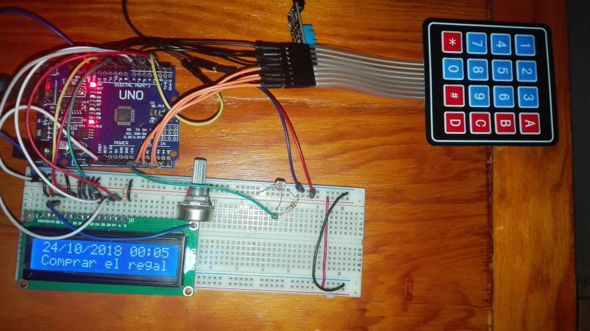
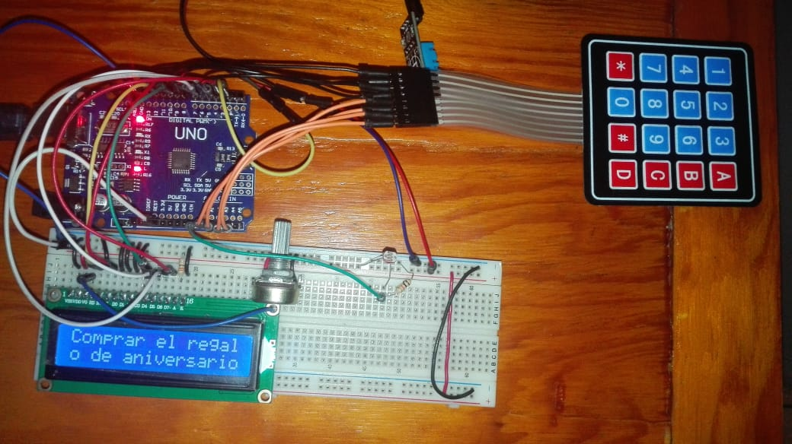
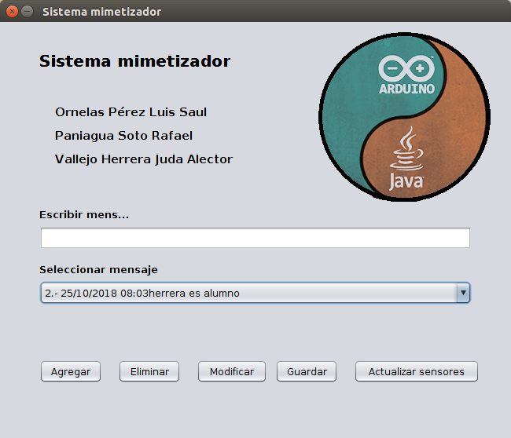
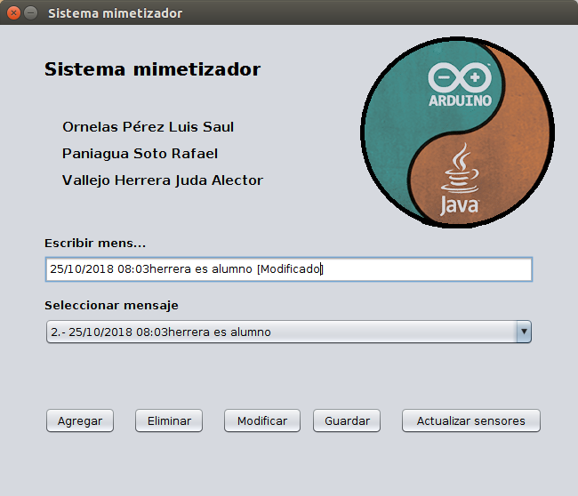
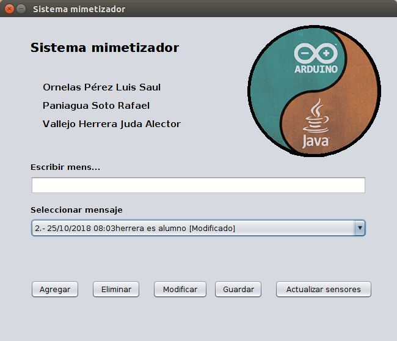

Sistema Mimetizador Visualizador de Mensajes
============================================

Autores
-------
* Ornelas Pérez Luis Saul
* Paniagua Soto Rafael
* Vallejo Herrera Juda Alector

Descripción de la Práctica
--------------------------

Realice un sistema para el despliegue de mensajes en una pantalla LCD, el objetivo es que al
llegar un individuo pueda ver en un pequeno tablero electronico una serie de mensajes o notas almacenados.

Cada mensaje tiene las siguientes caracteristicas:
Tienes que mostrar un mensaje, que se entienda, con sólo 140 caracteres de espacio. 
Debe de mostrat fecha y hora en la que fue emitido el mensaje.
Ademas debe de mostrar Un mensaje del estado del tiempo (Temperatura, Humedad, luminosidad)

El sistema debe contener:
Un interfaz de hardware para navegar entre los mensajes.
Una interfaz de software para enviar los mensajes desde la computadora via serial.
La interfaz de software debe permitir agreagr mensajes y/o borrarlos.

Material
--------
### Hardware

* 1 Arduino UNO
* 1 Protoboard
* 1 Display LCD 16X2
* 1 Potenciómetro 10 kOhms
* 1 Resistencia 330 Ohms
* 1 Teclado Matricial
* 1 Sensor DHT11
* 1 Fotoresistencia
* 1 Resistencia 10 kOhms
* Cables conectores

### Software
* IDE Arduino
* IDE Netbeans
* Lenguaje de programación Java

Resultados de la Práctica
-------------------------
### Armado del circuito

### Prueba eliminación mensaje

### Prueba actualización mensaje

